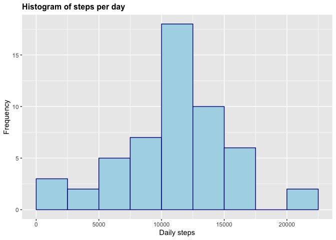
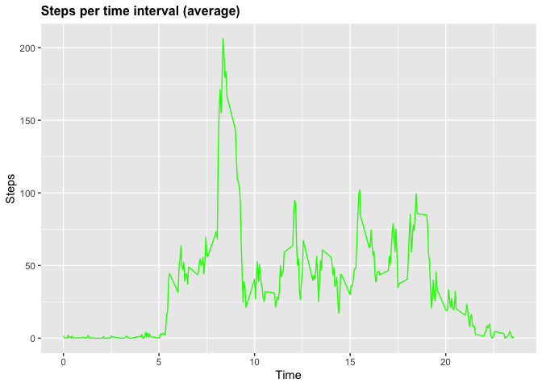
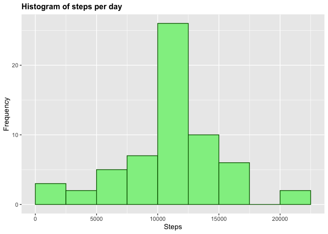
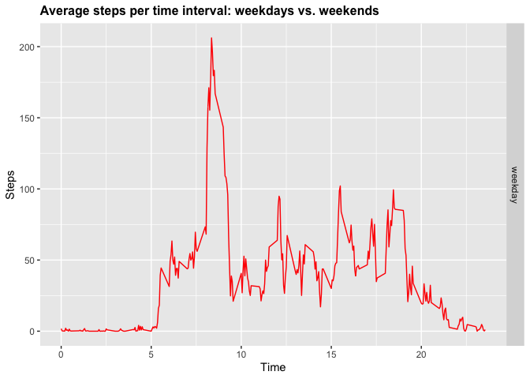

Reproducible Research: Week 2 Project 
=======================================

## Loading and preprocessing the data


```r
download.file("https://d396qusza40orc.cloudfront.net/repdata%2Fdata%2Factivity.zip", destfile = "activity.zip", mode="wb") 
unzip("activity.zip") 
stepdata <- read.csv("activity.csv", header = TRUE) 
head(stepdata)
```

```
##   steps       date interval
## 1    NA 2012-10-01        0
## 2    NA 2012-10-01        5
## 3    NA 2012-10-01       10
## 4    NA 2012-10-01       15
## 5    NA 2012-10-01       20
## 6    NA 2012-10-01       25
```

## I. What is mean total number of steps taken per day?
### 1. Calculate the total number of steps taken per day

```r
StepsPerDay <- aggregate(stepdata$steps, list(stepdata$date), FUN=sum)
colnames(StepsPerDay) <- c("Date", "Steps")
head(StepsPerDay)
```

```
##         Date Steps
## 1 2012-10-01    NA
## 2 2012-10-02   126
## 3 2012-10-03 11352
## 4 2012-10-04 12116
## 5 2012-10-05 13294
## 6 2012-10-06 15420
```

### 2.Make a histogram of the total number of steps taken each day

```r
library(ggplot2)
g <- ggplot(StepsPerDay, aes(Steps))
g+geom_histogram(boundary=0, binwidth=2500, col="darkblue", fill="lightblue")+ggtitle("Histogram of steps per day")+xlab("Daily steps")+ylab("Frequency")+theme(plot.title = element_text(face="bold", size=12))
```

```
## Warning: Removed 8 rows containing non-finite values (stat_bin).
```

<!-- -->

### 3. Calculate and report the mean and median of the total number of steps taken per day

```r
mean(StepsPerDay$Steps, na.rm=TRUE)
```

```
## [1] 10766.19
```


```r
median(StepsPerDay$Steps, na.rm=TRUE)
```

```
## [1] 10765
```

## II. What is the average daily activity pattern?

### 1. A time series plot
Make a time series plot of the 5-minute interval (x-axis) and the average number of steps taken, averaged across all days (y-axis)


```r
StepsPerTime <- aggregate(steps~interval,data=stepdata,FUN=mean,na.action=na.omit)
StepsPerTime$time <- StepsPerTime$interval/100
h <- ggplot(StepsPerTime, aes(time, steps))
h+geom_line(col="green")+ggtitle("Steps per time interval (average)")+xlab("Time")+ylab("Steps")+theme(plot.title = element_text(face="bold", size=12))
```

<!-- -->

### 2. 5-minute intervalwith the maximum number of steps
Which 5-minute interval, on average across all the days in the dataset, contains the maximum number of steps?


```r
library(dplyr)
```

```
## 
## Присоединяю пакет: 'dplyr'
```

```
## Следующие объекты скрыты от 'package:stats':
## 
##     filter, lag
```

```
## Следующие объекты скрыты от 'package:base':
## 
##     intersect, setdiff, setequal, union
```

```r
my_tbl_1 <- tibble::as_tibble(StepsPerTime)
my_tbl_1 %>% select(time, steps) %>% filter(steps==max(my_tbl_1$steps))
```

```
## # A tibble: 1 x 2
##    time steps
##   <dbl> <dbl>
## 1  8.35  206.
```

## III. Imputing missing values

### 1. Calculate and report the total number of missing values in the dataset

```r
my_tbl_2 <- tibble::as_tibble(stepdata)
my_tbl_2 %>% filter(is.na(steps)) %>% summarize(missing_values = n())
```

```
## # A tibble: 1 x 1
##   missing_values
##            <int>
## 1           2304
```

### 2. Filling in all of the missing values in the dataset


```r
stepdata$CompleteSteps <- ifelse(is.na(stepdata$steps), round(StepsPerTime$steps[match(stepdata$interval, StepsPerTime$interval)],0), stepdata$steps)
head(stepdata)
```

```
##   steps       date interval CompleteSteps
## 1    NA 2012-10-01        0             2
## 2    NA 2012-10-01        5             0
## 3    NA 2012-10-01       10             0
## 4    NA 2012-10-01       15             0
## 5    NA 2012-10-01       20             0
## 6    NA 2012-10-01       25             2
```

### 3. Create a new dataset with the missing data filled in


```r
activity_full <- data.frame(steps=stepdata$CompleteSteps, interval=stepdata$interval, date=stepdata$date)
head(activity_full)
```

```
##   steps interval       date
## 1     2        0 2012-10-01
## 2     0        5 2012-10-01
## 3     0       10 2012-10-01
## 4     0       15 2012-10-01
## 5     0       20 2012-10-01
## 6     2       25 2012-10-01
```

### 4. Make a histogram of the total number of steps taken each day


```r
StepsPerDayFull <- aggregate(activity_full$steps, list(activity_full$date), FUN=sum)
colnames(StepsPerDayFull) <- c("Date", "Steps")
g <- ggplot(StepsPerDayFull, aes(Steps))
g+geom_histogram(boundary=0, binwidth=2500, col="darkgreen", fill="lightgreen")+ggtitle("Histogram of steps per day")+xlab("Steps")+ylab("Frequency")+theme(plot.title = element_text(face="bold", size=12))
```

<!-- -->

### 5. Calculate and report the mean and median 


```r
mean(StepsPerDayFull$Steps)
```

```
## [1] 10765.64
```


```r
median(StepsPerDayFull$Steps)
```

```
## [1] 10762
```

Imputing missing data has only a little impact on the mean ant the median of the total daily number of steps. 

## IV. Are there differences in activity patterns between weekdays and weekends?

### 1. Create a new factor variable in the dataset with two levels - “weekday” and “weekend” indicating whether a given date is a weekday or weekend day


```r
activity_full$RealDate <- as.Date(activity_full$date, format = "%Y-%m-%d")
activity_full$weekday <- weekdays(activity_full$RealDate)
activity_full$DayType <- ifelse(activity_full$weekday=='Saturday' | activity_full$weekday=='Sunday', 'weekend','weekday')
head(activity_full, n=10)
```

```
##    steps interval       date   RealDate     weekday DayType
## 1      2        0 2012-10-01 2012-10-01 понедельник weekday
## 2      0        5 2012-10-01 2012-10-01 понедельник weekday
## 3      0       10 2012-10-01 2012-10-01 понедельник weekday
## 4      0       15 2012-10-01 2012-10-01 понедельник weekday
## 5      0       20 2012-10-01 2012-10-01 понедельник weekday
## 6      2       25 2012-10-01 2012-10-01 понедельник weekday
## 7      1       30 2012-10-01 2012-10-01 понедельник weekday
## 8      1       35 2012-10-01 2012-10-01 понедельник weekday
## 9      0       40 2012-10-01 2012-10-01 понедельник weekday
## 10     1       45 2012-10-01 2012-10-01 понедельник weekday
```

### 2. Make a panel plot containing a time series plot (i.e. type = “l”) of the 5-minute interval (x-axis) and the average number of steps taken, averaged across all weekday days or weekend days (y-axis).


```r
StepsPerTimeDT <- aggregate(steps~interval+DayType,data=activity_full, FUN=mean,na.action=na.omit)
StepsPerTimeDT$time <- StepsPerTime$interval/100
j <- ggplot(StepsPerTimeDT, aes(time, steps))
j+geom_line(col="red")+ggtitle("Average steps per time interval: weekdays vs. weekends")+xlab("Time")+ylab("Steps")+theme(plot.title = element_text(face="bold", size=12))+facet_grid(DayType ~ .)
```

<!-- -->


